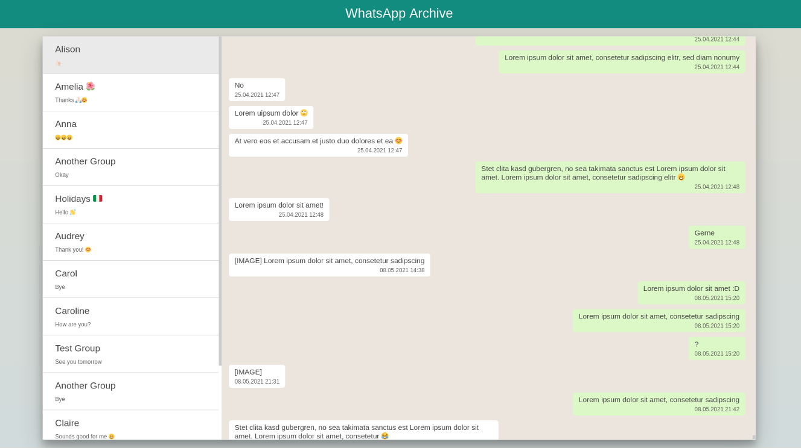

# WhatsApp Exporter

A python script for extracting WhatsApp conversations from the app's SQLite database and exporting them as HTML or txt files.



## Features
* Export WhatsApp chats to a WhatsApp Web like HTML page.
* Export WhatsApp chats to txt files (one per chat).

## Usage

1. Prerequisite: The Whatsapp database files must be available (see the following section).
2. Supply all configuration values in `config.cfg`. Here, the paths to the database files must be given. The `wa.db` 
   database is only needed for adding names of contacts and does not need to be used.
3. Run the main script.

```shell
python3 main.py
```

## Retrieving WhatsApp Databases

For retrieving the WhatsApp database files from an Android device there are several options. Two of them are described in this section.

### Option A
WhatsApp stores all messages in SQLite databases in the app directory `/data/data/com.whatsapp/`. These can be 
downloaded to a computer using `adb`, e.g. when the Android device is booted to a recovery such as *TWRP* 
(or when the device is rooted). Copy all WhatsApp files to the local directory `my_WhatsApp` using the following command.

```shell
adb pull /data/data/com.whatsapp/ my_WhatsApp/
```

The directory `my_WhatsApp` now contains the following relevant files:

* `com.whatsapp/databases/msgstore.db`: The database for storing all messages.
* `com.whatsapp/databases/wa.db`: The database for storing contacts.

### Option B
It is also possible to decrypt a WhatsApp backup file. These backups are generated by WhatsApp and can be found in the 
publicly accessible device storage (e.g. `sdcard0/WhatsApp/Databases/msgstore.db.crypt12`).
Obviously, the decryption key (which is stored in the app's private storage) is still required. The tool
[WhatsApp-Crypt12-Decrypter](https://github.com/EliteAndroidApps/WhatsApp-Crypt12-Decrypter) can be used to decrypt a backup file:

`python3 decrypt12.py key msgstore.db.crypt12 msgstore.db`

## License

This project is licensed under the [GNU General Public License v3.0](https://www.gnu.org/licenses/gpl-3.0).

*This project is not endorsed or certified by WhatsApp Inc.*
